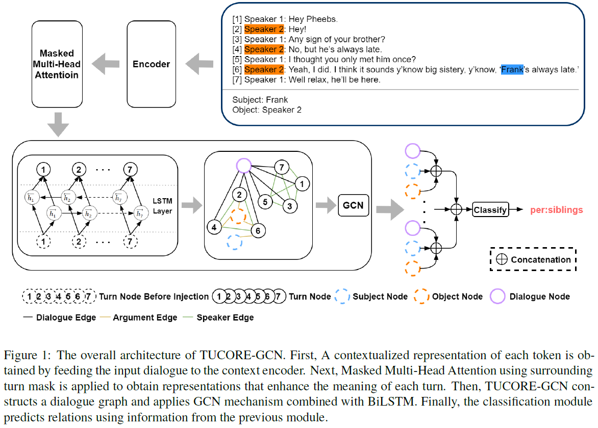

# Graph Based Network with Contextualized Representations of Turns in Dialogue (EMNLP 2021)

**Official PyTorch implementation of our EMNLP paper: [Graph Based Network with Contextualized Representations of Turns in Dialogue](https://arxiv.org/abs/2109.04008)**<br>



## Environments

- python		(3.8.3)
- cuda			(11.0)
- Ubuntu-18.04.5 

## Requirements

- dgl-cu110			   (0.5.3)
- torch					   (1.7.0)
- numpy					(1.19.2)
- sklearn
- regex
- packaging
- tqdm

PS: If you use Docker, you can download Docker images that we used in our experiment [here](https://hub.docker.com/r/tjr4090/tucore-gcn).

## Usage

- run_classifier.py : Code to train and evaluate the model
- data.py : Code to define Datasets / Dataloader for TUCORE-GCN
- evaluate.py : Code to evaluate the model on DialogRE
- models/BERT : The directory containing the TUCORE-GCN for BERT version
- models/RoBERTa : The directory containing the TUCORE-GCN for RoBERTa version
- datasets/MELD/MELD4TUCOREGCN.py : Code to convert the MELD to DialogRE style as suggested in the paper
- datasets/EmoryNLP/EMORY4TUCOREGCN.py : Code to convert the EmoryNLP to DialogRE style as suggested in the paper
- datasets/DailyDialog/DailyDialog4TUCOREGCN.py : Code to convert the DailyDialog to DialogRE style as suggested in the paper

## Preparation

### Dataset

#### DialogRE

- Download data from [here](https://github.com/nlpdata/dialogre) 
- Put `train.json`, `dev.json`, `test.json` from ```data_v2/en/data/``` into the directory `datasets/DialogRE/`

#### MELD

- Download data from [here](https://github.com/declare-lab/MELD) 
- Put `train_sent_emo.csv`, `dev_sent_emo.csv.json`, `test_sent_emo.csv.json` from ```data/MELD/``` into the directory `datasets/MELD/`
- In  `MELD`, execute  `python MELD4TUCOREGCN.py`

#### EmoryNLP

- Download data from [here](https://github.com/emorynlp/emotion-detection) 
- Put `emotion-detection-trn.json`, `emotion-detection-dev.json`, `emotion-detection-tst.json` from ```json/``` into the directory `datasets/EmoryNLP/`
- In  `EmoryNLP`, execute  `python EMORY4TUCOREGCN.py`

#### DailyDialog

- Download and unzip data from [here](http://yanran.li/dailydialog.html) 
- Put  and unzip`train.zip`, `validation.zip`, `test.zip` from ```ijcnlp_dailydialog/``` into the directory `datasets/DailyDialog/`
- In  `DailyDialog`, execute  `python DailyDialog4TUCOREGCN.py`

### Pre-trained Language Models

#### BERT Base

- Download and unzip BERT-Base Uncased from [here](https://github.com/google-research/bert), and copy the files into the directory `pre-trained_model/BERT/`
- Set up the environment variable for BERT by ```export BERT_BASE_DIR=/PATH/TO/BERT/DIR```. 
- In `pre-trained_model`, execute ```python convert_tf_checkpoint_to_pytorch_BERT.py --tf_checkpoint_path=$BERT_BASE_DIR/bert_model.ckpt --bert_config_file=$BERT_BASE_DIR/bert_config.json --pytorch_dump_path=$BERT_BASE_DIR/pytorch_model.bin```.

#### RoBERTa Large

- Download and unzip RoBERTa-large from [here](https://github.com/pytorch/fairseq/tree/master/examples/roberta), and copy the files into the directory `pre-trained_model/RoBERTa/`
- Set up the environment variable for RoBERTa by ```export RoBERTa_LARGE_DIR=/PATH/TO/RoBERTa/DIR```. 
- In `pre-trained_model`, execute ```python convert_roberta_original_pytorch_checkpoint_to_pytorch.py --roberta_checkpoint_path=$RoBERTa_LARGE_DIR --pytorch_dump_folder_path=$RoBERTa_LARGE_DIR```.

## Training & Evaluation

### BERT + DialogRE

- Execute the following commands in ```TUCORE-GCN```:

```
python run_classifier.py --do_train --do_eval --encoder_type BERT  --data_dir datasets/DialogRE --data_name DialogRE   --vocab_file $BERT_BASE_DIR/vocab.txt   --config_file $BERT_BASE_DIR/bert_config.json   --init_checkpoint $BERT_BASE_DIR/pytorch_model.bin   --max_seq_length 512   --train_batch_size 12   --learning_rate 3e-5   --num_train_epochs 20.0   --output_dir TUCOREGCN_BERT_DialogRE  --gradient_accumulation_steps 2

rm TUCOREGCN_BERT_DialogRE/model_best.pt

python evaluate.py --dev datasets/DialogRE/dev.json --test datasets/DialogRE/test.json --f1dev TUCOREGCN_BERT_DialogRE/logits_dev.txt --f1test TUCOREGCN_BERT_DialogRE/logits_test.txt --f1cdev TUCOREGCN_BERT_DialogRE/logits_devc.txt --f1ctest TUCOREGCN_BERT_DialogRE/logits_testc.txt --result_path TUCOREGCN_BERT_DialogRE/result.txt
```

### BERT + MELD

- Execute the following commands in ```TUCORE-GCN```:

```
python run_classifier.py --do_train --do_eval --encoder_type BERT  --data_dir datasets/MELD --data_name MELD   --vocab_file $BERT_BASE_DIR/vocab.txt   --config_file $BERT_BASE_DIR/bert_config.json   --init_checkpoint $BERT_BASE_DIR/pytorch_model.bin   --max_seq_length 512   --train_batch_size 12   --learning_rate 3e-5   --num_train_epochs 10.0   --output_dir TUCOREGCN_BERT_MELD  --gradient_accumulation_steps 2

rm TUCOREGCN_BERT_MELD/model_best.pt
```

### BERT + EmoryNLP

- Execute the following commands in ```TUCORE-GCN```:

```
python run_classifier.py --do_train --do_eval  --encoder_type BERT --data_dir datasets/EmoryNLP --data_name EmoryNLP   --vocab_file $BERT_BASE_DIR/vocab.txt   --config_file $BERT_BASE_DIR/bert_config.json   --init_checkpoint $BERT_BASE_DIR/pytorch_model.bin   --max_seq_length 512   --train_batch_size 12   --learning_rate 3e-5   --num_train_epochs 10.0   --output_dir TUCOREGCN_BERT_EmoryNLP  --gradient_accumulation_steps 2

rm TUCOREGCN_BERT_EmoryNLP/model_best.pt
```

### BERT + DailyDialog

- Execute the following commands in ```TUCORE-GCN```:

```
python run_classifier.py --do_train --do_eval  --encoder_type BERT --data_dir datasets/DailyDialog --data_name DailyDialog   --vocab_file $BERT_BASE_DIR/vocab.txt   --config_file $BERT_BASE_DIR/bert_config.json   --init_checkpoint $BERT_BASE_DIR/pytorch_model.bin   --max_seq_length 512   --train_batch_size 12   --learning_rate 3e-5   --num_train_epochs 10.0   --output_dir TUCOREGCN_BERT_DailyDialog  --gradient_accumulation_steps 2

rm TUCOREGCN_BERT_DailyDialog/model_best.pt
```

### RoBERTa + DialogRE

- Execute the following commands in ```TUCORE-GCN```:

```
python run_classifier.py --do_train --do_eval --encoder_type RoBERTa  --data_dir datasets/DialogRE --data_name DialogRE   --vocab_file $RoBERTa_LARGE_DIR/vocab.json --merges_file $RoBERTa_LARGE_DIR/merges.txt  --config_file $RoBERTa_LARGE_DIR/config.json   --init_checkpoint $RoBERTa_LARGE_DIR/pytorch_model.bin   --max_seq_length 512   --train_batch_size 12   --learning_rate 5e-6   --num_train_epochs 30.0   --output_dir TUCOREGCN_RoBERTa_DialogRE  --gradient_accumulation_steps 2

rm TUCOREGCN_RoBERTa_DialogRE/model_best.pt

python evaluate.py --dev datasets/DialogRE/dev.json --test datasets/DialogRE/test.json --f1dev TUCOREGCN_RoBERTa_DialogRE/logits_dev.txt --f1test TUCOREGCN_RoBERTa_DialogRE/logits_test.txt --f1cdev TUCOREGCN_RoBERTa_DialogRE/logits_devc.txt --f1ctest TUCOREGCN_RoBERTa_DialogRE/logits_testc.txt --result_path TUCOREGCN_RoBERTa_DialogRE/result.txt
```

### RoBERTa + MELD

- Execute the following commands in ```TUCORE-GCN```:

```
python run_classifier.py --do_train --do_eval --encoder_type RoBERTa  --data_dir datasets/MELD --data_name MELD   --vocab_file $RoBERTa_LARGE_DIR/vocab.json --merges_file $RoBERTa_LARGE_DIR/merges.txt   --config_file $RoBERTa_LARGE_DIR/config.json   --init_checkpoint $RoBERTa_LARGE_DIR/pytorch_model.bin   --max_seq_length 512   --train_batch_size 12   --learning_rate 5e-6   --num_train_epochs 10.0   --output_dir TUCOREGCN_RoBERTa_MELD  --gradient_accumulation_steps 2

rm TUCOREGCN_RoBERTa_MELD/model_best.pt
```

### RoBERTa + EmoryNLP

- Execute the following commands in ```TUCORE-GCN```:

```
python run_classifier.py --do_train --do_eval --encoder_type RoBERTa  --data_dir datasets/EmoryNLP --data_name EmoryNLP   --vocab_file $RoBERTa_LARGE_DIR/vocab.json --merges_file $RoBERTa_LARGE_DIR/merges.txt   --config_file $RoBERTa_LARGE_DIR/config.json   --init_checkpoint $RoBERTa_LARGE_DIR/pytorch_model.bin   --max_seq_length 512   --train_batch_size 12   --learning_rate 5e-6   --num_train_epochs 10.0   --output_dir TUCOREGCN_RoBERTa_EmoryNLP  --gradient_accumulation_steps 2

rm TUCOREGCN_RoBERTa_EmoryNLP/model_best.pt
```

### RoBERTa + DailyDialog

- Execute the following commands in ```TUCORE-GCN```:

```
python run_classifier.py --do_train --do_eval  --encoder_type RoBERTa --data_dir datasets/DailyDialog --data_name DailyDialog   --vocab_file $RoBERTa_LARGE_DIR/vocab.json --merges_file $RoBERTa_LARGE_DIR/merges.txt   --config_file $RoBERTa_LARGE_DIR/config.json   --init_checkpoint $RoBERTa_LARGE_DIR/pytorch_model.bin   --max_seq_length 512   --train_batch_size 12   --learning_rate 5e-6   --num_train_epochs 10.0   --output_dir TUCOREGCN_RoBERTa_DailyDialog  --gradient_accumulation_steps 2

rm TUCOREGCN_RoBERTa_DailyDialog/model_best.pt
```

## Citation

